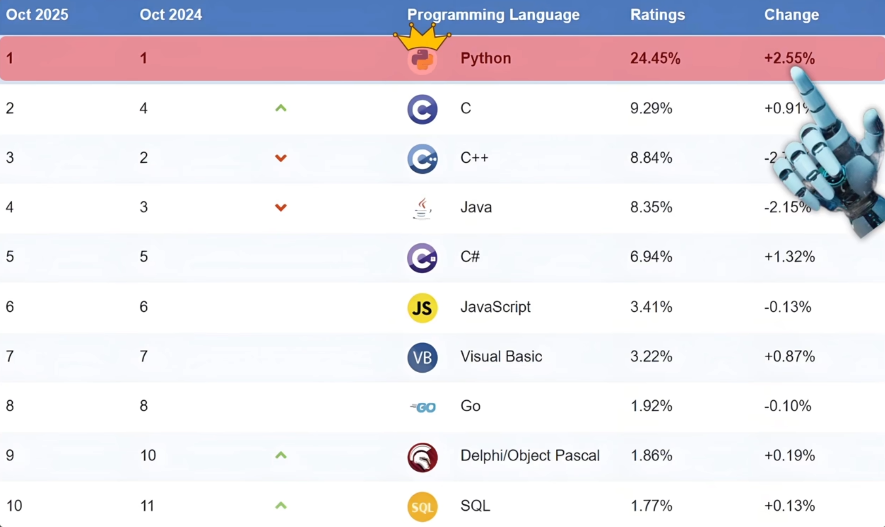
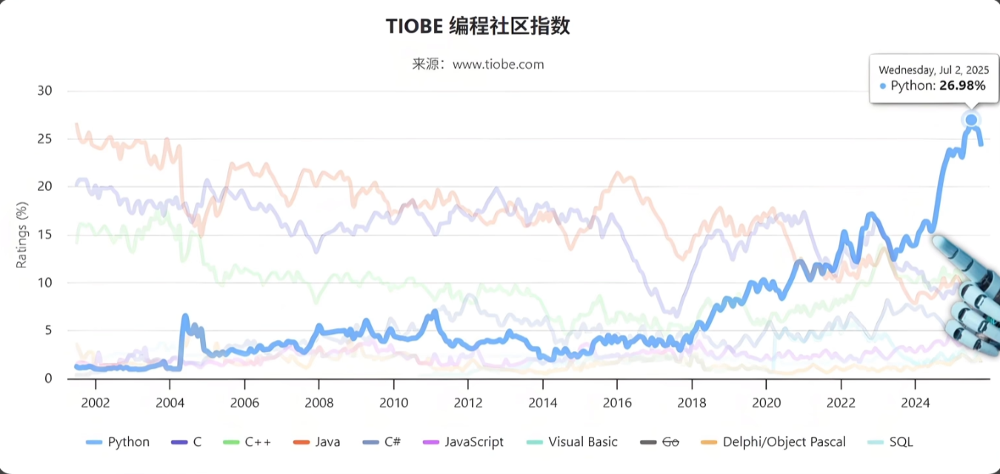

# Python Study

## Python 的介绍

2025 年 TIOBE 编程语言排行榜：

历年来各编程语言 TIOBE 指数走势：

Python 能做：

+ 网络爬虫
+ Web 开发
+ 数据分析
+ 机器人
+ AI 大模型

### Python 的起源

python 的作者是 Guido van Rossum，因为名字前三个字母的发音跟汉语的龟同音，所以他在国内被网友亲切地称为龟叔。

龟叔是荷兰人，拥有数学和计算机背景，当时在一家研究所上班，白天写 C 相关的代码，晚上则用 bash 或 shell 写一些系统脚本。久而久之，龟叔觉得用 C 用来写代码太麻烦了，因为很多内容都需要亲自去写，shell 脚本写起来倒是挺轻松，但遇到复杂的任务，就不行了。

所以，有没有一种既能像 C 语言那样全面操控系统，又能像 shell 一样好上手的语言呢？随后，龟叔一边干活一边着手研究。

于 1989 年冬天，写出了 python 的第一个解释器。

于 1991 年正式发布了第一个 python 脚本（python 0.9.0）

至于为什么叫 python，其实是因为龟叔是名喜剧迷，他特别喜欢 《Monty Python's Flying Circus》 这部喜剧，这部喜剧的风格特点轻松自由、没有任何条条框框约束，跟龟叔理想的编程风格一样。所以，龟叔把这部剧的 python 拿出来作为了新创建的编程语言的名字。

### Python 的特点

**优点：**

+ 语法简洁、可读性强、代码结构清晰、上手难度低

+ 开发效率高
  + 内置：网络通信、文本处理、数据库、图形系统等强大功能
  + 社区：有各个领域的三方库可使用，如：Web 开发、科学计算、人工智能

+ 跨平台运行，一份 python 代码可以在 Windows、Linux、MacOS 等多个平台上运行

+ 应用领域广
  + 自动化脚本、桌面工具
  + 数据处理、科学计算
  + 网络爬虫
  + Web 开发
  + AI / 机器学习

**缺点：**

+ 运行速度较慢。python 是解释型语言，代码运行时要通过解释器转成机器码再执行，不像 C、C++ 等语言，事先编译成机器码，而后直接运行

+ 代码无法加密。 python 是开源语言，最终发布的 `.py` 文件很容易被逆向查看源码逻辑，保护代码知识产权略显困难（行内针对这种情况的解决方案是讲 `.py` 文件转成可执行文件来分享，而不分享 python 源码文件，比如：windows 桌面工具，分享的是 `.exe` 文件，而不分享 `.py` 文件）

+ 内存消耗略大。相比 C、C++ 这种紧凑型语言，python 更吃内存，不太适合资源受限设备，比如：微控制器等。

### AI 领域广泛使用 Python 的缘由

+ 简洁直观的开发体验

    AI 开发中有很多试错、调模型、调参数等过程。

    开发人员使用 Python 可以更快速地实现想法，调试和维护也更简单。可以将精力更专注在算法和逻辑上，而不是语言细节。

+ 丰富强大的框架生态

    python 相关的轮子不仅多且好用。如：PyTorch、TensorFlow、Scikit-learn 这些都是顶级的 AI 框架。

+ 与底层语言高效协作

    很多 AI 框架表面是 python，其实底层是用 C 或 C++ 实现的，比如：矩阵运算、GPU 加速等这些都是由底层的高性能代码完成。

    python 更多是类似指挥员，负责写流程、调度这些高性能代码

+ 社区活跃且人才充足

    python 拥有庞大且活跃的社区，全球无数科研人员、工程师都在分享经验。

    在各个领域基于 python 所研发的工具包和解决方案层出不穷。

    校园中也在广泛推广 python，企业的 AI 项目也将 python 作为主要开发语言。

+ 业内大厂+主流推动
    2015 年谷歌开源了 TensorFlow，2016 年 Facebook 开源了 PyTorch，头部大厂出的 AI 框架，都是第一时间支持 Python。

    从学术实验到工业领取的机器学习，都大量采用 Python 编写。

## 一 必备基础知识和前置准备

[跳转到此章节](./chapter/一_必备基础知识和前置准备/README.md)

## 二 Python 基础知识

[跳转到此章节](./chapter/二_Python基础知识/README.md)
