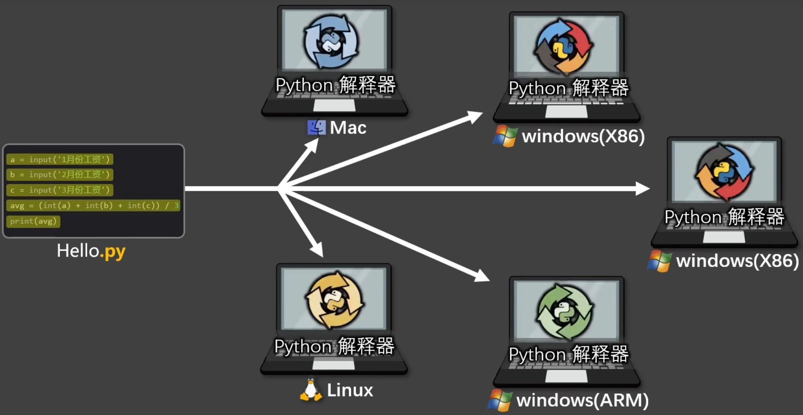
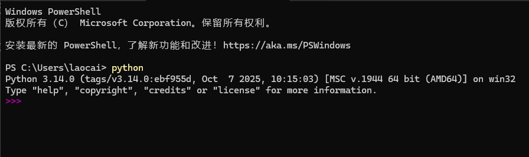

# 一 必备基础知识和前置准备

[返回主目录](../README.md)

## 1 必备基础知识

高级语言主要分为：**编译型**和**解释型**。

### 编译型

以 C 语言为例，过程如下图：

1. Hello.c 里面是我们编写的 c 语言代码，因为 CPU 不能执行高级语言代码，所以有了下面步骤
2. 编译器负责编译 Hello.c，生成汇编代码（CPU 依旧不能运行）
3. 汇编代码会被汇编器汇编，生成二进制机器码。注意：此时的机器码还只是零散的代码片段，缺少很多完整的结构和一些外部函数地址，而这些内容由链接器完成
4. 链接器会将这些零散的二进制代码片段（机器码）和外部函数地址链接起来，拼成完整的结构
5. 最终生成可直接运行的可执行文件，比如：Windows 系统的 `.exe` 文件
6. 对于多台要用到这个可执行文件的电脑，只需分别复制过去即可，而不需要再进行以上步骤。注意：这里的多台电脑要求操作系统和 CPU 架构均相同

**优点：**

同一运行平台，代码只需编译一次，执行效率高

**缺点：**

跨平台性差，大型项目编译时间较长，开发效率略低

### 解释型

以 Python 语言为例，过程如下图：

Hello.py 同样不能直接被 CPU 执行，需要被翻译成被 CPU 识别的机器码，只不过翻译的过程没有编译型语言那么麻烦，只需安装一个 python 解释器即可。

python 解释器可以对 python 代码逐行读取和翻译，将 python 代码直接翻译成 CPU 可以执行的操作代码。

如果多台电脑要运行 python 代码，只需要在各个电脑上安装 python 解释器即可，在不同的平台可以安装不同版本的 python 解释器，比如：Windows X86 架构系统需要安装 X86 版本的 python 解释器，ARM 架构系统则需要安装 ARM 版本的 python 解释器，同理 Linux 和 Mac 系统也是如此。

**优点：**

跨平台性好，无需编译，开发调试灵活高效

**缺点：**

每次运行都需要重新解释，执行效率较低

## 2 前置准备 - 搭建 Python 开发环境

### 下载 Python 解释器

在 [python 的官方下载地址](https://www.python.org/downloads/) 可以下载最新版的 python 解释器，用来运行 python 代码。下载如图：

可嵌入式安装包，就是跟你的项目打包到一起的安装包，在安装项目的时候，会连带着这个 python 解释器的安装包一起安装。

安装完成之后，通过 `python --version` 即可查到对应的版本信息

以上是 Windows 系统的安装，Mac 系统的安装也大差不差，主要是在 python 命令的不同：

Windows 系统的 python 命令是 `python --version`，Mac 的是 `python3 --version`。

如果想 Mac 和 Windows 一样都是使用 `python --version`，可以通过下面代码设置：

`sudo echo 'alias python="python3"' >> .zshrc`

### Python 解释器的使用

在终端通过 `python` 命令可以进入 python 交互式解释器（python shell），如下图：

在这里可以输入一段 python 代码（在 `>>>` 的右侧输入），并快速得到代码的执行结果。

如果想退出该界面，可以输入 `exit()` 或 `Ctrl + Z` 后，按下回车键即可退出。

除了交互式界面，也可以直接运行一个 python 文件，比如：现有一个 `test.py` 文件，在该文件目录下打开终端，通过 `python test.py` 即可运行该文件。

### 安装和设置 PyCharm

PyCharm 是一套用于 python 的集成开发环境，主要提供以下功能：

- 可自定义的代码编辑器
- 自动补全 + 语法高亮
- 提供调试器，便于快速找出代码错误
- 组织文件、管理工程结构

通过 [PyCharm 的官方下载地址](https://www.jetbrains.com/zh-cn/pycharm/download/?section=windows)，可以下载一个完整版，其中包含 1 个月的 pro 版本，pro 版本到期后，可以继续使用免费版

如学业需要，可用魔法工具。详情见 PyCharm_magic 文件夹
