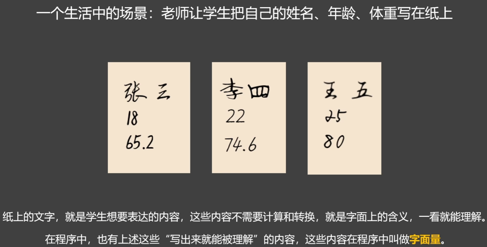
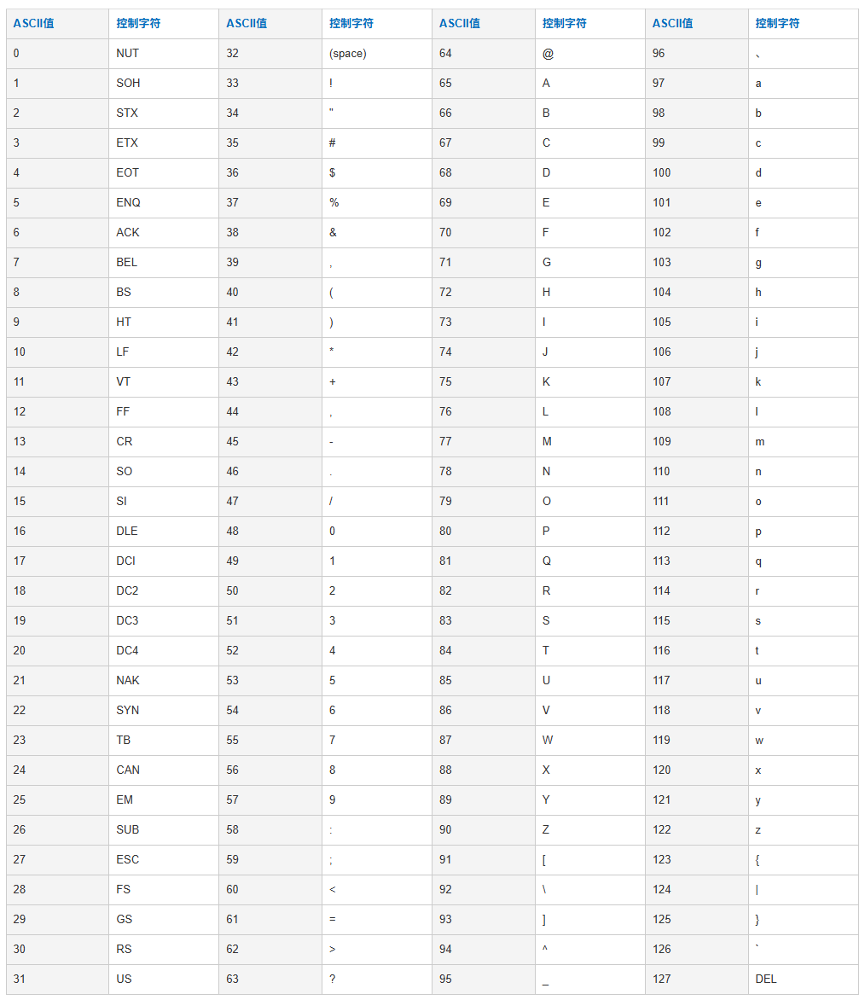

# 二 Python 核心基础

[返回主目录](../../README.md)

## 1 字面量、变量和常量

### 字面量

**字面量**就是直接写在代码中的具体的值，参考下图例子：



python 中的字符串可以包含任意字符，但必须用**引号**包裹。

字符串的引号，可以是：单引号、双引号、三个单引号、三个双引号

写在 py 文件顶部的字符串，会被识别为 `docstring`（文档字符串），文档字符串必须使用三个双引号的写法 `""" """`。

### 变量

python 中的变量是一个**代号**，用来和某个值（字面量、函数、类等等）建立**绑定关系**，并且这个绑定关系是可以随时改变的。

变量的主要作用：当我们想读取或修改某个值时，可以通过变量去完成读取和修改操作。

语法：

```py
变量名 = 值
name = '张三'
```

**注意：**变量必须跟值建立绑定关系，而不能只声明变量，否则 python 会解析为读取变量。

**备注：**在 PyCharm 中，如果对变量进行了新的赋值操作而没有使用新赋的值，会有黄色警告。

### 常量

常量就是一旦被赋值就不希望被修改的值。

在 python 中，一般约定用全大写变量名来表示常量，设计多个单词时，用下划线用分隔，如：`USER_NAME`

**注意：**在 python 中，并没有强制的常量机制，其所谓的常量，本质还是变量，只不过约定好不去修改，比如：看到 `USER_NAME` 就知道这个变量是常量，后续的代码编辑中，大家就默认都不会改这个变量的值。如果真的去改了这个常量，python 也不会报错，这个要注意！！！

### 命名规则

**标识符：**程序中所有我们可以自定义名字（如：变量名、函数名、类名、模块名等等）的内容。

关于标识符的命名规则：

- 只能包含：数字、字母和下划线，且不能以数字开头
- 标识符区分大小写，如：`Name` 和 `name` 是两个不同标识符
- 标识符不能使用关键字
- 标识符尽量别用内置函数名
- 标识符虽然没有长度限制，但应尽量简洁清晰，具有描述性
- 标识符可以用大小驼峰和蛇形（下划线分隔单词）写法

## 2 注释和字符编码

### 注释

注释是对代码的备注和解释，在代码执行时，通常不起任何作用。

#### 单行注释

以 `#` 开头的后一行内容，会被视为注释

```py
# python 的单行注释
print(100)
```

#### 多行注释

python 中并没有真正的多行注释语法，所谓多行注释本质是一个字符串字面量。

可以使用**三个单引号**或**三个双引号**的方式编写多行注释。

比如：

```py
'''
python 的多行注释
USER_NAME 是用户名
AGE 是用户年龄
'''
```

为什么这种多行注释的方式能被使用呢？

主要是因为这串字符串在代码中并没有被用到，python 解释器执行代码的时候，会忽略这种未被使用的字符串。

#### 文件编码注释

文件编码注释 `#coding=utf-8` 一般写在 python 文件的开头，用来指定当前文件的字符编码，注意：`#` 和 `coding` 之间没有间隔。

当文档字符串和文档编码注释都需要时，前者应写在后面的后面

```py
#coding=utf-8

"""这是文档字符串，且文档字符串必须用双引号"""
```

**备注：**python3 不需要写文档编码注释，因为默认就是 `utf-8` 这个万国码编码。

### 字符编码

`utf-8` 是万国码，可以对任意语言进行编码（全球语言通吃）。

在 python3 中默认的编码方式就是 `utf-8`，所以 python3 中无需编写文档编码注释。


早期的编码方式是 `ASCII`，只包含大小写字母、数字和一些符号，共计 128 个。



对于使用英语的国家，`ASCII` 码表已足够用。

随着计算机传入欧洲，欧洲人发现他们没法输入内容到计算机，因为 `ASCII` 码表不支持他们的内容。

于是在 `ASCII` 码表的基础上，扩充了一些希腊字符，形成了 `ISO 8859-1` 码表，共计 256 个

后来到了我们国家，又继续扩充，形成了 `GB2312` 码表（GB 表示国标），这个码表收录了 6763 个常用汉字和 682 个字符。随着对 `GB2312` 的完善和发展，我们国家又推出一套新的码表 `GBK`（GB 还是国标的意思，K 表示扩充），此码表收录的汉字和符号达到 20000+，且支持繁体中文。

随着世界各国的不断扩充，就形成了最终的万国码 `utf-8`

所以，我们在存储数据时，要采用合适的字符编码，否则无法存储，数据丢失，比如：你要用 `ISO8859-1` 来编码存储汉字的数据，那么因为该码表没有汉字对应的编码，导致无法转成对应的二进制数，而导致无法存储丢失数据。同理，解码也要采用和存储时编码相同的码表，否则数据能呈现，但是都是乱码，比如：你用 `utf-8` 编码的中文数据存储起来了，然后用 `ISO8859-1` 来解码数据，数据可以呈现，只是都是乱码。

## 3 数据类型

### 3.1 基本数据类型

#### 字符串

##### 定义

用 `''` 或 `""` 包裹起来的数据叫做字符串，如：`"张三"`、`'李四'`。

字符串的定义有 4 种方式：

- 通过单引号定义字符串，该字符串不能换行，如非要在代码中换行显示（实际输出还是不换行），需要用圆括号括起来
  ```py
  str1 = ('动漫1-'
        '海贼王')
  str2 = '动漫2-火影忍者'
  print('单引号定义字符串-换行显示==', str1)
  print('单引号定义字符串==', str2)
  # 单引号定义字符串-换行显示== 动漫1-海贼王
  # 单引号定义字符串== 动漫2-火影忍者
  ```
- 通过双引号定义字符串，特性跟单引号一样
  ```py
  str3 = ("电影1"
        "-侏罗纪")
  str4 = "电影2-黑衣人"
  print('双引号定义字符串-换行显示==', str3)
  print('双引号定义字符串==', str4)
  # 双引号定义字符串-换行显示== 电影1-侏罗纪
  # 双引号定义字符串== 电影2-黑衣人
  ```
- 通过 3 对单引号定义字符串，可以在字符串中换行（实际输出也会换行），同时还能作为多行注释使用
  ```py
  str5 = '''天天学习，努力向上'''
  str6 = '''床前明月光，
  疑是地上霜'''
  print('3 对单引号定义字符串==', str5)
  print('3 对单引号定义字符串-换行显示和输出==', str6)
  # 3 对单引号定义字符串== 天天学习，努力向上
  # 3 对单引号定义字符串-换行显示和输出== 床前明月光，
  # 疑是地上霜
  ```
- 通过 3 对双引号定义字符串，特性跟 3 个单引号一样，此外，还能作为文档字符串使用（放在文档首行或文档编码注释下面）
  ```py
  str7 = """努力向上，天天学习"""
  str8 = """疑是地上霜，
  床前明月光"""
  print('3 对双引号定义字符串==', str7)
  print('3 对双引号定义字符串-换行显示和输出==', str8)
  # 3 对双引号定义字符串== 努力向上，天天学习
  # 3 对双引号定义字符串-换行显示和输出== 疑是地上霜，
  # 床前明月光
  ```

[相关代码：字符串的定义](codes/字符串_定义.py)

##### 格式化输出

格式化输出，就是按照预先定义的 `格式`，将 `变量` 和 `计算结果`，`插入` 到字符串中并输出。

###### 方式 1：`+` 拼接

直接用 `+` 拼接，注意：只能拼接字符串，不能拼接其他类型，否则会报错。

```py
name = '张三'
gender = "男"
infor = '我叫' + name + ', 我是' + gender + '的'
print('infor==', infor)
# infor== 我叫张三, 我是男的
```

这种方式拼接字符串，如果拼接的内容很多，会非常麻烦，代码书写起来不方便。

###### 方式 2：使用占位符

使用 `%s`、`%f`、`%i`、`%d` 等占位符来占位，然后将变量插入。

- `%s`，表示占位字符串，此占位符是万能的，可以接受来自浮点数、整数等类型的变量或数据插入（背后默认会将这些类型的值转成字符串）
- `%f`，表示占位浮点数，除了能接收浮点数，还能接收整数，对于整数会自动补零
- `%i`，表示占位整数，除了能接收整数，还能接收浮点数，对于浮点数会向下取整
- `%d`，表示占位十进制整数，跟 `%i` 相同

```py
name = '张三'
gender = "男"
weight = 127.8
age = 18
level = 12

infor2 = '我叫%s' % name
print('占位符-单个==', infor2)
# 占位符-单个== 我叫张三

infor3 = '我叫%s，%s的，体重是%f，年龄是%i，今年读%d年级' % (name, gender, weight, age, level)
print('占位符-多个==', infor3)
# 占位符-多个== 我叫张三，男的，体重是127.800000，年龄是18，今年读12年级

infor4 = '我叫%s，%s的，体重是%s，年龄是%s，今年读%s年级' % (name, gender, weight, age, level)
print('占位符-全用%s==', infor4)
# 占位符-全用%s== 我叫张三，男的，体重是127.8，年龄是18，今年读12年级

infor5 = '我叫%s，%s的，体重是%i，年龄是%i，今年读%i年级' % (name, gender, weight, age, level)
print('占位符-数值全用%i==', infor5)
# 占位符-全用%i== 我叫张三，男的，体重是127，年龄是18，今年读12年级

infor6 = '我叫%s，%s的，体重是%d，年龄是%d，今年读%d年级' % (name, gender, weight, age, level)
print('占位符-数值全用%d==', infor6)
# 占位符-全用%d== 我叫张三，男的，体重是127，年龄是18，今年读12年级

infor7 = '我叫%s，%s的，体重是%f，年龄是%f，今年读%f年级' % (name, gender, weight, age, level)
print('占位符-数值全用%f==', infor7)
# 占位符-全用%f== 我叫张三，男的，体重是127.800000，年龄是18.000000，今年读12.000000年级
```

**扩展：占位符精度控制**

对于占位符，可以在 `%` 和 `字母` 之间加入 `m.n` 来对插入数据进行一些限制，格式如：`%m.ns`、`%m.sd`、`%m.ni`、`%m.nf`

- `%m.ns`，这里的 `m` 

**扩展：转移字符**

###### 方式 3：使用 f-string

`f-string` 是 python 官方最推荐的字符串格式化输出方式。

具体是在字符串第一个单/双引号之前添加一个字符 `f`，用来告诉 python 解释器，将要在字符串中嵌入一些内容，嵌入的内容将写在字符串的 `{}` 中。

这种方式不需要嵌入位置对应嵌入内容的数据类型，任意类型均可插入嵌入位置，因为背后会默认将所有非字符串类型转成字符串类型。（类似占位符中的全 `%s`）

```py
infor8 = f'我叫{name}，{gender}的，体重是{weight}，年龄是{age}，今年读{level}年级'
print('f-string 单引号==,', infor8)
# f-string 单引号==, 我叫张三，男的，体重是127.8，年龄是18，今年读12年级

infor9 = f"我叫{name}，{gender}的，体重是{weight}，年龄是{age}，今年读{level}年级"
print('f-string 双引号==,', infor9)
# f-string 双引号==, 我叫张三，男的，体重是127.8，年龄是18，今年读12年级

infor10 = f'''我叫{name}，{gender}的，体重是{weight}，年龄是{age}，今年读{level}年级'''
print('f-string 三对单引号==,', infor10)
# f-string 三对单引号==, 我叫张三，男的，体重是127.8，年龄是18，今年读12年级

infor11 = f"""我叫{name}，{gender}的，体重是{weight}，年龄是{age}，今年读{level}年级"""
print('f-string 三对双引号==,', infor11)
# f-string 三对双引号==, 我叫张三，男的，体重是127.8，年龄是18，今年读12年级
```

[相关代码：字符串的格式化输出](codes/字符串_格式化输出.py)

#### 整型

所有不带小数点的数，都是整型，可以是正数、负数和 0，如：`18`、`-22`、`0`。

```py
int1 = 18
print('type of int1==', type(int1))
# type of int1== <class 'int'>

int2 = 20
print('type of int2==', type(int2))
# type of int2== <class 'int'>

int3 = 0
print('type of int3==', type(int3))
# type of int3== <class 'int'>
```

当数很大时，可以使用下划线将数据进行分组，来让数字更易读（python 运行这段代码的时候会将下划线去掉），如：`300_000`、`100_000_000`

```py
int4 = 1_000
print('int4==', int4)
# int4== 1000

int5 = 999_999_999
print('int5==', int5)
# int5== 999999999
```

**扩展内容：**

python 中整数的上限值取决于执行代码的计算机的内存和处理能力，运行如下所示代码会提示报错：`ValueError: Exceeds the limit (4300 digits) for integer string conversion; use sys.set_int_max_str_digits() to increase the limit`

```py
testNumMaxLen = 9 ** 9999
print('testNumerLen==', testNumMaxLen)

'''
Traceback (most recent call last):
  File "D:\python_study\chapter\二_Python核心基础\codes\整型.py", line 17, in <module>
    print('testNumerLen==', testNumMaxLen)
    ~~~~~^^^^^^^^^^^^^^^^^^^^^^^^^^^^^^^^^
ValueError: Exceeds the limit (4300 digits) for integer string conversion; use sys.set_int_max_str_digits() to increase the limit
'''
```

之所以有这个报错，是因为 print 在打印数字的时候，内部会将数字转换成字符串再打印。

在 python 内部数字转字符串时，要求数字不能超过 4300 位，于是有了这个报错。如果要解开这个限制，按照报错提示使用 `sys.set_int_max_str_digits(0)` 方法即可解除这个限制，参数为 0 代表不限制。

```py
import sys

testNumMaxLen = 9 ** 9999
sys.set_int_max_str_digits(0)
print('testNumerLen==', testNumMaxLen)

# testNumerLen== 295700380801935532...（数字太长以省略号代表）
```

[相关代码：整型](./codes/整型.py)

#### 浮点型

浮点型就是带有小数点的数字，如：65.2、-74.6、120.0。

```py
num1 = 65.2
print("type of num1==", type(num1))
# type of num1== <class 'float'>

num2 = -74.6
print("type of num2==", type(num2))
# type of num2== <class 'float'>

num3 = 120.0
print("type of num3==", type(num3))
# type of num3== <class 'float'>
```

浮点型的科学计数法：

- `123e+2`，表示 123 乘以 10 的二次方
- `456e-3`，表示 456 乘以 10 的负三次方

**注意：**

- `123e+2` = `123e2` = `123E+2` = `123E2`。同理，`456e-3` = `456E-3`
  ```py
  num4 = 123e+2
  num5 = 123e2
  num6 = 123E+2
  num7 = 123E2
  num8 = 456e-3
  num9 = 456E-3
  print("123e+2==", num4)
  print("123e2==", num5)
  print("123E+2==", num6)
  print("123E2==", num7)
  print("456e-3==", num8)
  print("456E-3==", num9)
  # 123e+2== 12300.0
  # 123e2== 12300.0
  # 123E+2== 12300.0
  # 123E2== 12300.0
  # 456e-3== 0.456
  # 456E-3== 0.456
  ```
- 科学计数法最终的结果即使没有小数数值，也会带有小数点

[相关代码：浮点型](./codes/浮点型.py)

### 3.2 引用数据类型

### 3.3 查看数据类型

#### 查看基本数据类型

python 中可以通过内置函数 `type()`，来查看某个数据的数据类型，如下示例：

- 字符串类型是 `str`
- 整型类型是 `int`
- 浮点型类型是 `float`

```py
str1 = '张三'
str1Type = type(str1)
print('type of str1==', str1Type)
# type of str1== <class 'str'>

str2 = '18'
str2Type = type(str2)
print('type of str2==', str2Type)
# type of str2== <class 'str'>

str3 = '22.2'
str3Type = type(str3)
print('type of str3==', str3Type)
# type of str3== <class 'str'>

int1 = 20
int1Type = type(int1)
print('type of int1==', int1Type)
# type of int1== <class 'int'>

float1 = 25.2
float1Type = type(float1)
print('type of float1==', float1Type)
# type of str1== <class 'float'>
```

[相关代码：数据类型](./codes/数据类型.py)

#### 查看引用数据类型

**注意：**python 中的变量是没有类型的，这个变量的类型指的是变量所对应的值的类型。

## 4 运算符

## 5 逻辑语句

## 6 函数

## 7 列表

## 8 元组

## 9 集合

## 10 字典

## 11 数据容器

## 12 类
